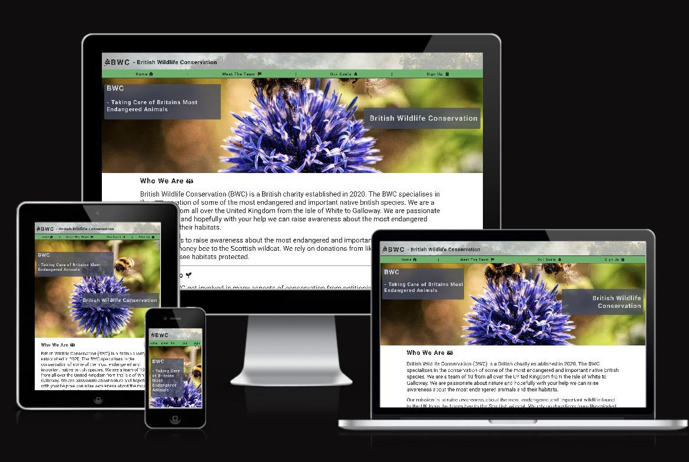
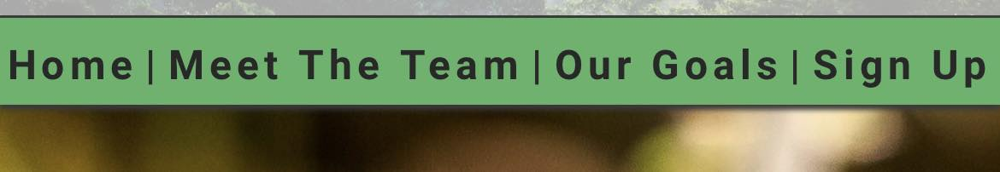
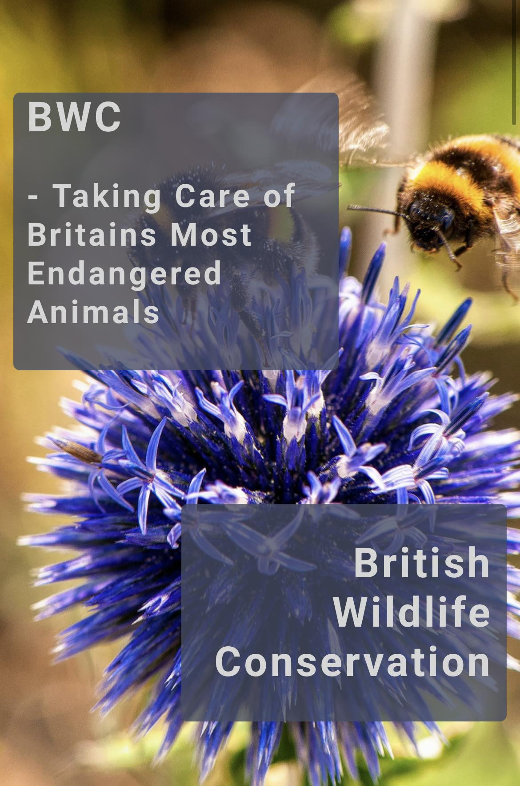
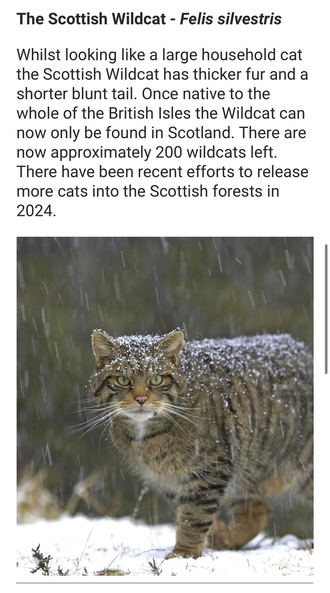
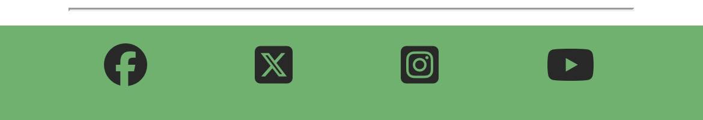
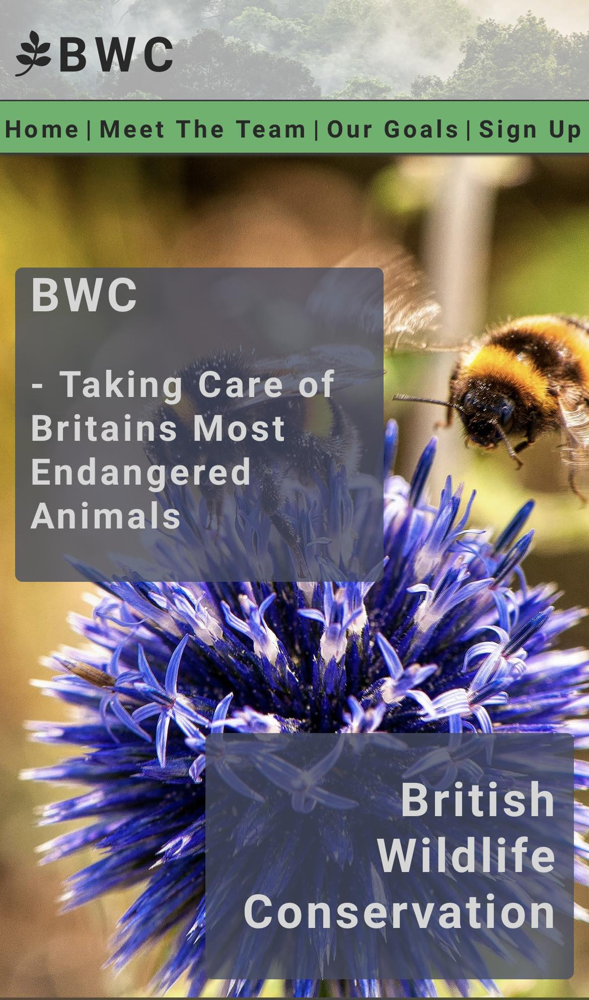
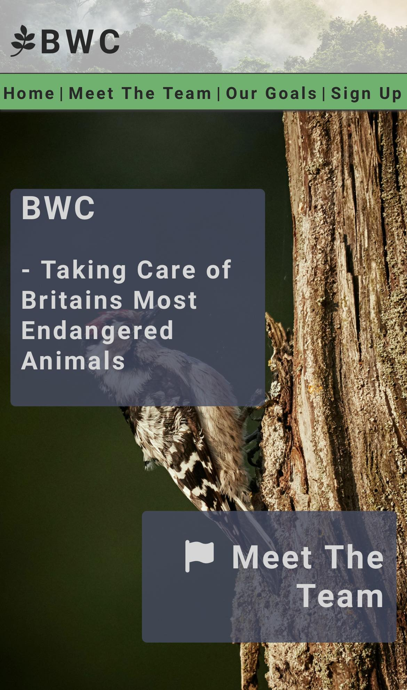
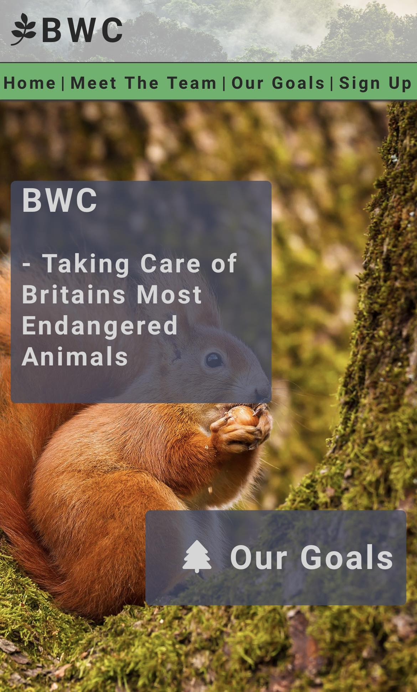
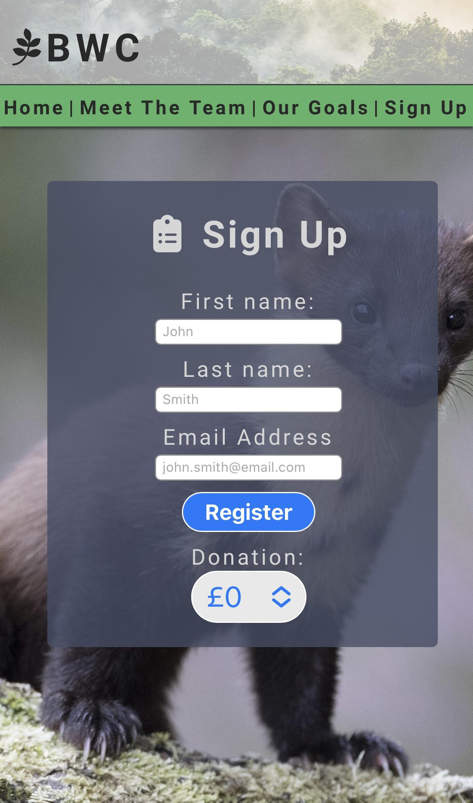

# BWC - British Wildlife Conservation

This website has been created in order to promote a fictional British charity the British Wildlife Conservation or BWC. The BWC relies on donations from supporters and to reward patrons they release a weekly newsletter which includes details about wildlife conservation. 

The site is made up of 4 pages; The landing page, Meet The Team, Our Goals and Sign up. Each page being semantically linked using the same header and title area but containing different images and content. 

Usability of the BWC site on different screen sizes was at the forefront of the design. Multiple media queries and the use of flex box properties allows for the BWC site to adapt to different devices. 

As well as display on different screen types the BWC site was designed to be accessible for a variety of users by using semantic html code, aria labels, comments on links, and alternative text on images. Care has also been taken in the colours used as to not cause discomfort and aid readability. 

## Features

### Header
The header area of the BWC site was created by using an image of a forest and decreasing the opacity in order to blend it into the site and not clash with the header text. The Header text displays 'BWC' on a small screen and 'BWC - British Wildlife Conservation' on larger screen sizes. 

### Navigation
Directly beneath the header there is the navigation bar. The navigation bar includes the 4 headings of: Home, Meet The Team, Our Goals, Sign Up. The order of these remains consistent on all of the pages of the site. I chose the top of the document to contain the navigation links as this is what users expect to see from all websites. 

Similarly to the Header the navigation bar features dynamic changes depending on the size of the screen. On larger devices a Font Awesome icon is positioned to the right of the heading. The Font Awesome icons are used to be semantically similar to the header itself and also convey the idea of nature and conservation. 

### Hero Image 
On each of the 4 pages of this site there is a hero Image designed to take up the full width of the page and a height determined by the width of the users device either 600px or 400px. Each of the pages feature a different image of British wildlife including honeybees (on the home screen), a woodpecker, a red squirrel and a pine marten. 

### Hero Image Content Boxes
Within the hero image there are two boxes positioned close to the upper-right and lower-left of the hero image. The top box contains both the abbreviated and full name of the BWC. The lower box denotes which page the user is on as well as the same Font Awesome icon used in the header. 

### Content Area
Below the hero image there is the content area of the website. The content is separated by headings and horizontal line elements to assist the user. Within several of the sub-headings there ar photographs these are positioned below the text on small devices and to the side on larger screen sizes, alternating between left and right.

### Sign Up Button
At the bottom of each of the pages is a large red button that stands out significantly from the rest of the page with the text 'Sign Up' within it. Pressing this button will lead the user to the Sign Up page. 

### Footer
Within the footer area of the document there are 4 links to social media platforms arranged in a list and separated to spread the width of the screen. Each of the social media links also contains the equivalent Font Awesome icon. 

## Pages

### Home
The home page is the landing page of the site and is named index.html. It contains the familiar hero image and two text boxes. Below there are three paragraphs: Who We Are, What We Do and Species. Beneath the content of the page there is a sign up button and a footer with social media links. 

### Meet The Team
A page with similar styling to the landing page but with an alternative image of wildlife. On this page there is content relating to the mission statement of the BWC, a paragraph relating to the team and some detail of the charity and its formation. 

### Our Goals 
The Our Goals page again contains the same semantic elements and positioning of content but a different photo of nature. Within the content there is detail on the conservation action taken by the BWC and how the BWC uses its newsletter to teach others about conservation. 

### Sign Up 
The signup page contains a large central form and background image. The user can reach this page by pressing the Sign Up button on the navigation bar or the bottom of each page. The boxes used within the hero image were used to create this form. 

### Testing 

## Simple Testing 
In the early development stages the BWC site was tested using the << python3 -m http.server >> commands on my own browser to establish if the site was working the way in which I intended. I varied the size of my browser window to simulate using my site on different screen sizes. 

## Validator Testing
This project was tested using the W3C CSS tester https://jigsaw.w3.org/css-validator/validator and resulted in no errors. It was ran through the W3C HTML tester https://validator.w3.org/#validate_by_input which resulted in no errors for all pages. At the time of writing (26/05/2024) there are a number of errors within the sign-up.html document when validating by direct input; these generally take the form of unclosed and stray tags. I have attempted to rectify these to no avail, and will continue to try prior to submission. 

## Accessibility Testing
The Lighthouse feature was used to assess accessibility of the BWC website. This scores accessibility, best practices and SCO. All pages of the BWC website scored green in all the above tests. A further function of Lighthouse is to score the performance of the page. The BWC website scored orange in this test. I believe due to the large image sizes used.  

### Deployment 
The BWC site was deployed using GitHub using the following steps:
<ul>
    <li>On the settings section of the repository locate the pages section with the code and automation branch.</li> 
    <li>Deploy from main branch with /(root) selected.</li> 
    <li>Return to repository and select the deployments link at the right of the repository.</li>
</ul>

## Bugs
Following the deployment of the BWC site I noticed that CSS was not targeting the SignUp button successfully. I found the code for the Sign Up button within style.css and noticed several spaces where lines were removed and believed that this may be the cause. After removing these empty spaces and pushing the changes to GitHub the Sign Up button was successfully targeted by the CSS document.

I had originally used background images within the content section of the pages. I later realised that this was not best practice as the images from more than merely the background. I therefore changed these from divs containing the background image to image elements in their own right. This also allowed me to increase the accessibility by referring to these with alt labels for screen readers or if the image does not load.

## References 

## Media
Images were found using the following two sites: 
<ul>    
    <li>https://unsplash.com/s/photos/open-source</li>
    <li>https://www.pexels.com/</li>
</ul>

## Content 
Content for the pages was derived from the following:
<ul>
    <li>https://www.countryfile.com/wildlife/most-endangered-species-in-britain</li>
    <li>https://www.woodlandtrust.org.uk/trees-woods-and-wildlife/animals/mammals/scottish-wildcat/</li>
    <li>https://jeffollerton.co.uk/2022/07/13/have-honey-bees-declined-in-britain-an-update-of-the-numbers/</li>
</ul>

