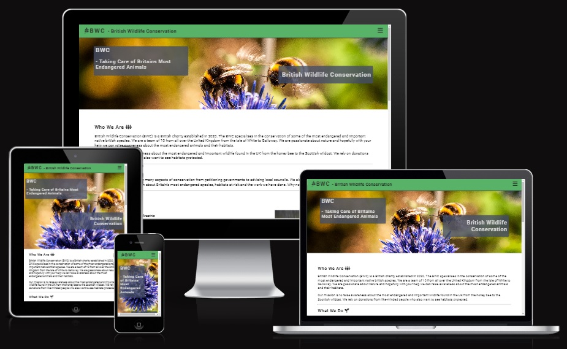

# BWC - British Wildlife Conservation

This website has been created in order to promote a fictional British charity the British Wildlife Conservation or BWC. The BWC relies on donations from supporters and to reward patrons they release a weekly newsletter which includes details about wildlife conservation.

The site is made up of 4 pages; The landing page, Meet The Team, Our Goals and Sign up. Each page being semantically linked using the same header and title area but containing different images and content.

Usability of the BWC site on different screen sizes was at the forefront of the design. Multiple media queries and the use of flex box properties allows for the BWC site to adapt to different devices. The BWC site was made using a mobile first approach where the initial design is built to be compatible with mobile devices and media queries are used to build upon the mobile centred design. This is due to the significant proportion of internet traffic coming from mobile devices.

As well as display on different screen types the BWC site was designed to be accessible for a variety of users by using semantic html code, aria labels, comments on links, and alternative text on images. Care has also been taken in the colours used to not cause discomfort and aid readability. Lighthouse testing using the Chrome developers tools has been used to test the accessibility of this site.

## Features

### Header
The header of this website uses a subtle green colouration which envokes the idea of nature. The name of the website is positioned at the left along with the simple clean logo from 'Font Awesome' (FA). This title and logo also acts as a home button returning the user to the index.html document from anywhere within the website. This position and functionality were chosen as this is what users have come to expect from a user experience / user interface (UX, UI) perspective.

The header has been fixed to the top of the website and will continue to be present even if the user scrolls down the page. This type of functionality was chosen such that the user was able to navigate to other pages on the website without the need to scroll to the top of the page.

### Navigation
Within the header there is an FA 'burger' icon which when clicked will reveal a drop down menu with the four page headings. The user is informed which page they are currently on by an underline on the active webpage. A simple burger icon without the words 'menu' or 'navigation' was chosen as once again users; particularly those on mobile devices have come to expect that burger icons will reveal a navigation bar. From testing this also appeared to be the case with the BWC website.

A simple and subtle green colour was chosen once again for the same reasons as the header but a slightly lighter shade was settled for in order to create separation between the navigation links and the header itself.

It was considered to remove the need for the FA icon on larger screen sizes and just position the navigation bar within the header. However, this idea was ruled out as the presence of the burger icon led to a significantly cleaner and less cluttered design even on larger screen sizes. Furthermore, for a UX standpoint, it is commonplace now for users to click on menu icons even on larger devices.

### Hero Image
On each of the 4 pages of this site there is a hero Image designed to take up the full width of the page and a height determined by the width of the users device either 600px (on smaller screens) or 400px (on larger screens). Each of the pages feature a different image of British wildlife including honeybees (on the home screen), a woodpecker, a red squirrel and a pine marten.

The images themselves were chosen specifically to highlight some of the species found in the British countryside. Also, be eye catching without distracting the user from the content within the page or the content within the two header boxes within the image itself.

### Hero Image Content Boxes
Within the hero image there are two boxes positioned close to the upper-right and lower-left of the hero image. The top box contains both the abbreviated and full name of the BWC. The lower box denotes which page the user is on as well as the same Font Awesome icon used in the header.

### Content Area
Below the hero image there is the content area of the website. The content is separated by headings and horizontal line elements to assist the user. Within several of the sub-headings there are photographs that are positioned below the text on small devices and to the side on larger screen sizes, alternating between left and right.

When images are used within the content area they are positioned below the relevant paragraph on smaller devices and to the side on larger devices. On larger devices the images will alternate between the left and the right. This was chosen to be aesthetically pleasing and break some of the symmetry found on the page.

### Sign Up Button
At the bottom of each of the pages is a large red button that stands out significantly from the rest of the page with the text 'Sign Up' within it. Pressing this button will lead the user to the Sign Up page. The signup button was styled using CSS such that it will change colour when hovered over or active.

Given the purpose of this website is to encourage the user to sign up to the newsletter it was necessary to make it as easy for the user to sign up as possible. One way to do this was by positioning the signup button at the bottom of each page and having a link to the signup page within the navigation.

The colour itself is significant for two reasons. Firstly, users have come to expect signup buttons or the like to be red in colour. Also, the colour itself is not used within the page aside from a small amount on the woodpecker hero image or a somewhat orange / red on the squirrel. This further makes this button stand out from the rest of the page as it does not appear within the colour scheme.

### Footer
Within the footer area of the document there are 4 links to social media platforms arranged in a list and separated to spread the width of the screen. Each of the social media links contains the equivalent Font Awesome icon. The links will open in a separate page and visually impaired users are notified of this with the content of the link. As this site is fictional it does not have social media accounts, instead the user is taken to the home page of each respective social media account.

## Pages

### Home
The home page is the landing page of the site and is named index.html. It contains the familiar hero image and two text boxes. Below there are three paragraphs: Who We Are, What We Do and Species. Beneath the content of the page there is a sign up button and a footer with social media links.

### Meet The Team
A page with similar styling to the landing page but with an alternative image of wildlife. On this page there is content relating to the mission statement of the BWC, a paragraph relating to the team and some detail of the charity and its formation.

### Our Goals
The Our Goals page again contains the same semantic elements and positioning of content but a different photo of nature. Within the content there is detail on the conservation action taken by the BWC and how the BWC uses its newsletter to teach others about conservation.

### Sign Up
The signup page contains a large central form and background image. The user can reach this page by pressing the Sign Up button on the navigation bar or the bottom of each page. The boxes used within the hero image were used to create this form.

## Testing

### Simple Testing
In the early development stages the BWC site was tested using the << python3 -m http.server >> commands on my own browser to establish if the site was working the way in which I intended. I varied the size of my browser window and user Chrome developer tools to simulate using my site on different screen sizes. Normal industry standard breakpoints were researched also.

### Validator Testing
This project was tested using the W3C CSS tester https://jigsaw.w3.org/css-validator/validator and resulted in no errors. It was ran through the W3C HTML tester https://validator.w3.org/#validate_by_input which resulted in no errors for all pages.

### Accessibility Testing
The Lighthouse feature was used to assess accessibility of the BWC website. This scores accessibility, best practices and SCO. All pages of the BWC website scored green in all the above tests. A further function of Lighthouse is to score the performance of the page. The BWC website scored orange in this test. I believe due to the large image sizes used.

Comments were also added throughout the code for myself, assessors or future developers to understand the purpose of the code.

## Deployment
The BWC site was deployed using GitHub using the following steps:
<ul>
    <li>On the settings section of the repository locate the pages section with the code and automation branch.</li>
    <li>Deploy from main branch with /(root) selected.</li>
    <li>Return to repository and select the deployments link at the right of the repository.</li>
</ul>

## Bugs
Following the deployment of the BWC site I noticed that CSS was not targeting the SignUp button successfully. I found the code for the Sign Up button within style.css and noticed several spaces where lines were removed and believed that this may be the cause. After removing these empty spaces and pushing the changes to GitHub the Sign Up button was successfully targeted by the CSS document.

I had originally used background images within the content section of the pages. I later realised that this was not best practice as the images from more than merely the background. I therefore changed these from divs containing the background image to image elements in their own right. This also allowed me to increase the accessibility by referring to these with alt labels for screen readers or if the image does not load.

## Amendments made following submission
Issues were found with this project following first submission they are as follows:
    Navigation difficult on smaller screen sizes
    html validation error due to space in filepath and ID used twice
    css code not commented enough
    some images appear stretched

### Navigation
Navigation links altered from being contained within the header to being hidden within a box that is opened when a font awesome burger icon clicked. Header is now fixed and will remain at the top of the page at all times. The decision was made to maintain this layout even on larger screen sizes. The header was altered from containing an image of woodland to green. The navigation links are clickable and operate as intended. The page the user is currently on is indicated by an underline on the navigation bar.

### html Validation
An issue was located within one of the html documents as there was white space in a file path. This did not affect the deployed site on chrome. This has been altered and all images no longer contain white space. It was discovered that an id was used twice within the page again this did not affect the website but is not best practice. That particular id was changed for a class.

### CSS Code
style.CSS now contains comments throughout both denoting the area of the page it corresponds to and the effect that styling has. The CSS starts with more general styles and then becomes more specific.

### Images stretched
All images have been altered to <code>object-fit: cover;</code> this prevents stretching of the image at all screen sizes. All background images have their background attachment fixed and remain static when scrolling.

## References

### Media
Images were found using the following two sites:
<ul>    
    <li>https://unsplash.com/s/photos/open-source</li>
    <li>https://www.pexels.com/</li>
</ul>

### Content
Content for the pages was derived from the following:
<ul>
    <li>https://www.countryfile.com/wildlife/most-endangered-species-in-britain</li>
    <li>https://www.woodlandtrust.org.uk/trees-woods-and-wildlife/animals/mammals/scottish-wildcat/</li>
    <li>https://jeffollerton.co.uk/2022/07/13/have-honey-bees-declined-in-britain-an-update-of-the-numbers/</li>
</ul>

### Code
The GitHub template provided by Code Institute including a number of plugins was used as a template for this project. The template was referenced through GitHub and is clearly shown within GitHub.

The navigation bar code used to open and close the navigation links using a form was taken from the Code Institute 'Love Running' project and adapted for use within the BWC website.
